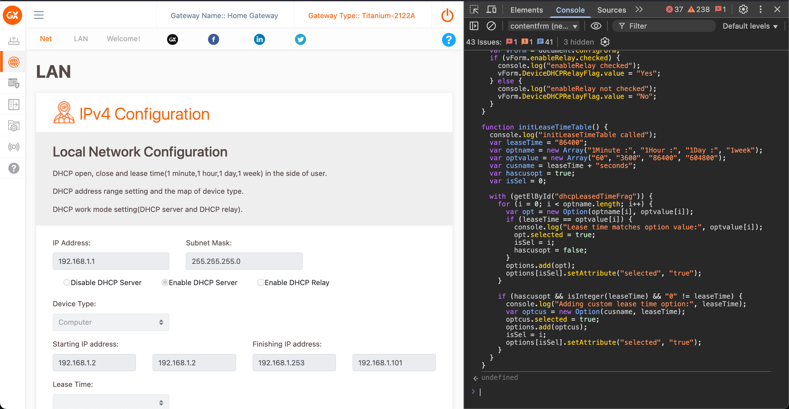

# ChangeDNS

ChangeDNS repository contains the code and instructions to change the DNS of the Airtel Router 

Product Title : Titanium 2122A
Product Name : Titanium T21 Pro

## Instructions 

This repository contains a script that helps you unlock and configure custom DNS settings on certain routers where the option is disabled in the UI.

## Steps to Use

1. Copy the code from `routerscript.js` in this repository.  
2. Open your router configuration page by navigating to `192.168.1.1` in your browser.  

3. Go to **Net → LAN**.  

4. Open the browser console by pressing **F12** or **Ctrl + Shift + I**.  

5. In the console, type `allow pasting` and then paste the copied code.  

6. Right-click and inspect the **Enable and Disable** button in the DNS settings. Remove the `disabled` attribute from the `<input>`.  

7. Remove the `disabled` attribute from the `<input>` fields for the **Primary** and **Secondary DNS**.  

8. Remove the `disabled` attribute from the **Submit** `<button>`.  

9. Enter the DNS values you want to configure. Examples:  
   - `1.1.1.1` and `1.0.0.1` for Cloudflare Primary and Secondary DNS  
   - `8.8.8.8` and `8.8.4.4` for Google Primary and Secondary DNS  
10. Click **Submit**.  
11. Restart your router for the changes to take effect.  

## Note 

This method won't work if you dont copy paste the script.  The script that exists in the repository are slight changes to the existing code already found in router settings, but with slight tweaks removing the restrictions for Airtel users not being able to change the router settings. 

## Warning

- This method modifies the router’s configuration interface in a non-standard way.  
- Proceed only if you understand the risks involved, as incorrect changes may cause your router to malfunction.  
- Always make sure you know how to reset your router to factory settings before experimenting.  
- Use this at your own responsibility; the author is not liable for any damage or connectivity issues.  

--- 

## Philosophy and reason

Airtel Makes it very hard for their customers to change their DNS. And the call centre is less than entuhsiastic about fixing this issue. So I tend to take things in my own hands and fix them myself. 

This is a very small project that I made in an hour of tinkering with the router. 

First I launched the router configuration in order to change the dns to the DNS of my choice. 
 
The username and password of this router was expected - admin 

Then after I logged in, I saw that the DNS was set to 192.168.1.1, which was the same IP as the router itself. The router then forwards the DNS requests to an Upstream DNS resolver, such as Airtel themselves. 

I feel like this is an invasion of privacy, and harms it's customers and erodes their trust. So In order to combat this issue, I feel like I need to take things into my own hands and change the DNS myself. 

